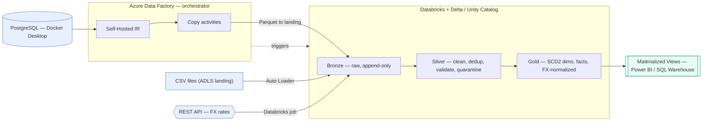

# E-Commerce Lakehouse Pipeline — Azure · Databricks · Delta Lake

An end-to-end, **industry-standard batch data platform** for a small e-commerce
company: three real ingestion patterns → Medallion (Bronze/Silver/Gold) on
Databricks/Delta → BI serving. Orchestrated by **Azure Data Factory**, governed by
**Unity Catalog**, provisioned with **Terraform**, shipped via **CI/CD**.

Deployable on an Azure + Databricks free trial — see **[docs/RUNBOOK.md](docs/RUNBOOK.md)**.
Interview prep: **[docs/INTERVIEW_PLAYBOOK.md](docs/INTERVIEW_PLAYBOOK.md)**.

## Architecture



| Layer | Tech |
|---|---|
| Sources | CSV in ADLS Gen2 · PostgreSQL on Docker (JDBC via SHIR) · REST API (FX rates) |
| Orchestration | Azure Data Factory (Copy + Databricks activities, tumbling-window incremental) |
| Compute / storage | Databricks (job clusters) · Delta Lake on ADLS Gen2 |
| Governance | Unity Catalog — grants, column masks, row filters, lineage/audit |
| Secrets | Azure Key Vault (KV-backed Databricks scope + ADF references) |
| IaC | Terraform (foundation + platform layers) |
| CI/CD | GitHub Actions — lint/test, `bundle validate`, `terraform plan/apply` (OIDC) |

See **[docs/ARCHITECTURE.md](docs/ARCHITECTURE.md)**, **[docs/SECURITY_GOVERNANCE.md](docs/SECURITY_GOVERNANCE.md)**,
**[docs/DATA_QUALITY.md](docs/DATA_QUALITY.md)**, **[docs/OPTIMIZATION.md](docs/OPTIMIZATION.md)**.

## Design Decisions (and why)

| Decision | Reasoning |
|---|---|
| Batch extract for transactional DB, not CDC | CDC (Debezium/Fivetran) adds real operational and cost overhead. Batch is simpler and sufficient unless near-real-time order visibility is a genuine business requirement. |
| Auto Loader for clickstream only | Clickstream arrives continuously/unpredictably — Auto Loader's incremental file detection is worth its overhead here, unlike the predictable DB extract. |
| Job clusters (spin-up/terminate), not always-on | Small data volume doesn't justify standing compute cost. |
| Databricks Workflows, not a separate Airflow deployment | Avoids the operational overhead of maintaining a second orchestration system for this scale. |
| SCD Type 2 on dim_product / dim_customer | Historical reporting (revenue by category) must stay point-in-time accurate even after reclassification. |
| ROW_NUMBER() dedup, not dropDuplicates() | dropDuplicates() keeps an arbitrary row; ROW_NUMBER() ordered by a timestamp guarantees the latest version survives. |
| Materialized Views for high-traffic dashboards only | Balances query speed against refresh/storage cost — not applied blindly to every table. |
| Unity Catalog governance | Schema-level isolation (Bronze/Silver restricted, Gold open), column masking for PII, row-level security by region, automatic lineage + audit logging. |

## Repo Structure

```
├── src/
│   ├── common/          # Shared: tuned Spark session, config, data-quality, Delta optimize
│   ├── ingestion/       # Batch extract + Auto Loader ingestion scripts
│   ├── bronze/          # Bronze layer loaders
│   ├── silver/          # Cleaning, dedup, config-driven validation
│   ├── gold/             # Dimensional model: SCD2 dimensions, fact merges
│   ├── maintenance/      # Weekly OPTIMIZE / ANALYZE / VACUUM job
│   └── governance/       # Unity Catalog setup: grants, masks, row filters
├── infra/terraform/      # IaC: foundation (Azure) + platform (Unity Catalog)
├── adf/                  # Azure Data Factory datasets / pipeline / trigger
├── docker/               # Local Postgres source (compose + seed data)
├── data/sample/          # Sample CSV for the ADLS landing source
├── sql/                  # DDL (self-optimizing tables) + views + governance
├── config/               # Pipeline configuration (paths, watermarks, DQ rules)
├── resources/            # Databricks Asset Bundle job definitions (deployable)
├── workflows/            # Legacy raw job JSON (reference only)
├── docs/                 # Architecture, runbook, security, interview playbook
├── tests/                # Unit tests for dedup / transformation logic
├── databricks.yml        # Asset Bundle: dev / staging / prod targets
├── .github/workflows/    # CI (lint + test + bundle validate) and CD (deploy)
├── pyproject.toml        # Ruff / Black / pytest config + project metadata
├── Makefile              # make lint | test | validate | deploy-dev
└── CHANGELOG.md          # Keep a Changelog + SemVer
```

## Development

```bash
python -m venv .venv && source .venv/bin/activate   # Windows: .venv\Scripts\activate
make install     # dev deps + pre-commit hooks
make lint        # ruff + black --check
make test        # pytest with coverage
```

See [CONTRIBUTING.md](CONTRIBUTING.md) for branching, Conventional Commits, and release steps.

## Code Versioning & Deployment (CI/CD)

Deployment is managed with **Databricks Asset Bundles** (`databricks.yml`) — the
source in git is the single source of truth for every environment. No job is
hand-edited in the workspace UI.

| Trigger | Pipeline | Action |
|---|---|---|
| Pull request / push to `main` | [`ci.yml`](.github/workflows/ci.yml) | Ruff, Black, pytest+coverage, `bundle validate` |
| Push to `main` | [`deploy.yml`](.github/workflows/deploy.yml) | Deploy bundle to **staging** |
| Tag `vX.Y.Z` | [`deploy.yml`](.github/workflows/deploy.yml) | Deploy bundle to **prod** (reviewer-gated) |

Deploy manually to your own sandbox:

```bash
databricks bundle validate -t dev
databricks bundle deploy   -t dev
databricks bundle run ecommerce_lakehouse_pipeline -t dev
```

Versioning follows [Semantic Versioning](https://semver.org/) — see `VERSION`
and [CHANGELOG.md](CHANGELOG.md). CI/CD credentials come from GitHub Environment
secrets (`DATABRICKS_HOST`, `DATABRICKS_TOKEN`); pipeline data secrets come from a
Databricks secret scope. Neither is ever committed.

## Pipeline Flow

1. **Ingest** — `src/ingestion/` pulls from sources into raw landing storage (S3/ADLS).
2. **Bronze** — `src/bronze/` loads raw files into Bronze Delta tables, append-only, minimal transformation.
3. **Silver** — `src/silver/` deduplicates (latest-wins via `ROW_NUMBER()`), validates, standardizes.
4. **Gold** — `src/gold/` merges into dimensional fact/dimension tables, with SCD Type 2 on dimensions.
5. **Serve** — `sql/materialized_views.sql` defines pre-aggregated views for Power BI, refreshed incrementally.
6. **Govern** — `src/governance/` applies Unity Catalog grants, column masks, and row filters.

## Requirements

- Databricks Workspace (AWS or Azure)
- Unity Catalog enabled
- Delta Lake (bundled with Databricks Runtime)
- Source credentials stored in a Key Vault / Secrets Manager–backed secret scope

## Running the Pipeline

See `workflows/databricks_workflow.json` for the full task DAG (Bronze → Silver → Gold → Refresh Views),
schedulable as a Databricks Workflow.
