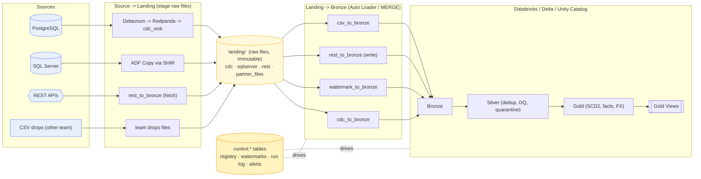

# Architecture v2 — Metadata-Driven Platform

A metadata-driven, multi-source lakehouse. Adding a table/endpoint/file is a
**one-line edit in `config/sources.yaml`** — no pipeline code changes. The control
tables (`control.*`) are the runtime brain; ADF is the orchestrator; Databricks is
the compute; Unity Catalog governs.

> **Every source lands first.** Watermark/CDC/CSV stage raw files to `landing/`
> then a loader Auto-Loads them into Bronze. **REST** is the one job that fetches,
> lands the raw JSON, and writes Bronze in a single pass (it still keeps the raw
> file for replay) — split it into land + load if you want it identical to the
> others.

## The four ingestion patterns

| Pattern | Source | Bridge | Bronze job | Multi-object |
|---|---|---|---|---|
| `watermark` | SQL Server | **ADF Copy + SHIR** | `watermark_to_bronze.py` | ForEach over N tables |
| `cdc` | Postgres | **Debezium → Redpanda → ADLS** | `cdc_to_bronze.py` (MERGE) | loops CDC tables |
| `rest` | Partner APIs | Databricks HTTP | `rest_to_bronze.py` | loops endpoints |
| `csv` | ADLS drops | Auto Loader | `csv_to_bronze.py` | loops file objects |

## Control plane (`sql/control/control_tables.sql`)

- **`source_objects`** — the registry (synced from `sources.yaml` by
  `framework/load_control.py`). ADF `Lookup` reads it to build the `ForEach`.
- **`watermarks`** — per-object high-watermark + last status.
- **`pipeline_runs`** — every (run, object, layer) with status/attempt/rowcounts;
  powers monitoring and *reprocess-only-failed* retry.
- **`dq_results`** — data-quality outcomes.
- **`alerts`** — decoupled alert outbox (dispatched by a separate job).

## Layers

`landing/` (raw files, immutable) → **Bronze** (append/MERGE, raw+metadata) →
**Silver** (typed, deduped, validated, PII-ready; bad rows quarantined) → **Gold**
(SCD2 dims, facts, FX-normalized) → **Gold Views** (materialized views for BI).

## Governance, security, monitoring

Unchanged from v1 and reused: Unity Catalog (schema grants, column masks, row
filters), Key Vault + managed identity (no keys), Terraform IaC, gitleaks. New:
`control.alerts` outbox + Azure Monitor alert rules (`infra/.../alerts.tf`) for
pipeline failures and freshness. See `SECURITY_GOVERNANCE.md`, `PRODUCTION_ISSUES.md`,
and `ORCHESTRATION.md`.
