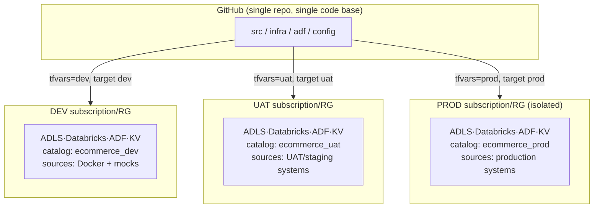
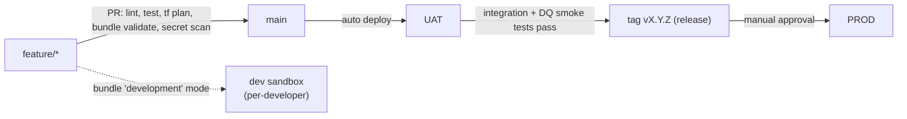

# Environments (dev / UAT / prod) & CI/CD

How the same code base runs in three isolated environments, and how a change is
promoted from a laptop to production safely.

## 1. Isolation model — everything is per-environment

Each environment is a **fully isolated stamp** of the platform. Nothing is shared
across environments except the git repo and the container registry of images.

| Resource | dev | uat | prod | Why isolated |
|---|---|---|---|---|
| Azure subscription / RG | `rg-ecomlakedev` | `rg-ecomlakeuat` | `rg-ecomlakeprod` (ideally its own **subscription**) | blast radius, cost tracking, RBAC |
| ADLS Gen2 | `st…dev` | `st…uat` | `st…prod` | data isolation |
| Databricks workspace | `dbw-…dev` | `dbw-…uat` | `dbw-…prod` | compute + access isolation |
| Unity Catalog catalog | `ecommerce_dev` | `ecommerce_uat` | `ecommerce_prod` | data governance boundary |
| Key Vault | `kv-…dev` | `kv-…uat` | `kv-…prod` | secret isolation |
| Azure Data Factory | `adf-…dev` | `adf-…uat` | `adf-…prod` | pipeline isolation |
| Terraform state | `…/dev.tfstate` | `…/uat.tfstate` | `…/prod.tfstate` | independent lifecycle |
| Deploy identity | SP-dev (OIDC) | SP-uat (OIDC) | SP-prod (OIDC) | least privilege per env |

Prod ideally lives in a **separate subscription** with tighter network (private
endpoints, VNet-injected workspace, storage firewall) and stricter RBAC.

**Same code, different config.** The code is environment-agnostic; per-env
differences live only in `*.tfvars` (infra), the bundle `targets` (databricks.yml),
ADF global parameters, and Key Vault secret *values*. Source connectivity differs
per env — dev points at the Docker/mocks, UAT/prod at their real systems via that
env's SHIR + linked services.

## 2. Branching & promotion

Trunk-based with short-lived feature branches; `main` is the source of truth.

| Stage | Trigger | Target | Gate |
|---|---|---|---|
| **CI** | every PR | — | ruff/black, pytest, `bundle validate`, `terraform plan`, gitleaks — all must pass |
| **Dev** | developer runs it | personal sandbox | none (bundle `mode: development` name-prefixes + pauses schedules) |
| **UAT** | merge to `main` | `uat` | CI green → auto `terraform apply` + bundle deploy + ADF publish → **integration + data-quality smoke tests** |
| **Prod** | publish a `vX.Y.Z` tag | `prod` | **manual approval** (GitHub Environment required reviewers) → apply + deploy → post-deploy smoke |

Dev is *not* a shared long-lived deploy target in CI — developers deploy their own
sandbox with the Databricks bundle's `development` mode. UAT is the first shared,
CI-managed environment; prod is gated and tag-driven so releases are deliberate
and traceable.

## 3. What CI/CD deploys, per component

Each component has its own pipeline, gated by the same env approvals:

| Component | Tooling | dev | uat | prod |
|---|---|---|---|---|
| **Infra** (RG, ADLS, KV, workspace, ADF, monitoring) | Terraform `foundation` | `apply -var-file=dev.tfvars` | on main | on tag (approval) |
| **Governance / UC** (catalog, schemas, grants, credential) | Terraform `platform` | after foundation | " | " |
| **Pipeline code + jobs** | Databricks Asset Bundle | `bundle deploy -t dev` | `-t uat` | `-t prod` |
| **ADF pipelines/datasets/triggers** | ADF Git integration → ARM, or `az datafactory` | dev factory | uat factory | prod factory |
| **Control registry** (`sources.yaml`, `gold_model.yaml`) | `load_control` job | synced per env | " | " |
| **DDL / governance SQL** | SQL job on the env's warehouse | " | " | " |

Order within an env: **Terraform foundation → platform → DDL/control → bundle
deploy → ADF publish → smoke tests**. The GitHub Actions workflows already model
this: `terraform.yml` (plan/apply), `ci.yml` (lint/test/validate), `deploy.yml`
(bundle per target), `secret-scan.yml`.

## 4. Identity & secrets (no long-lived credentials)

- CI authenticates to Azure with **OIDC federated credentials** — GitHub exchanges
  a short-lived token per run; nothing long-lived is stored. One **service
  principal per environment**, least-privileged to that env's RG.
- App/data secrets live in the **per-env Key Vault**; ADF reads them via managed
  identity, Databricks via a KV-backed secret scope. Secret *names* are identical
  across envs; only *values* differ, so code never changes.
- GitHub **Environments** (`azure-dev`, `azure-uat`, `azure-prod`) hold the env's
  `AZURE_*` / `DATABRICKS_*` references and the **required-reviewer** gate on prod.

## 5. Testing gates (shift-left)

| Layer | Where | What |
|---|---|---|
| Unit | CI (PR) | `pytest` — DQ, quarantine, standardize, gold model, dedup |
| Static | CI (PR) | ruff, black, `terraform validate`, `bundle validate`, gitleaks |
| Plan review | CI (PR) | `terraform plan` posted for human review |
| Integration | UAT (post-deploy) | run the master pipeline on UAT sources; assert row counts, watermark advance, quarantine ratio, control-table run status |
| Data quality | UAT + prod | the pipeline's own DQ/quarantine + freshness alerts are the runtime gate |
| Post-deploy smoke | prod | run a bounded slice; verify Gold KPIs + no CRITICAL alerts before marking the release healthy |

## 6. Rollback

- **Code/jobs**: redeploy the previous tag's bundle (`bundle deploy -t prod` from
  `vX.Y-1`). Bundle deploys are versioned and idempotent.
- **Infra**: `terraform apply` the previous commit's config (state is versioned in
  the azurerm backend); avoid destructive changes via plan review + `prevent_destroy`
  on stateful resources in prod.
- **Data**: Delta **time travel** / `RESTORE` a table to a prior version; replay
  from Bronze (immutable) or from `landing/` if a Silver/Gold bug shipped.
- **Pipeline**: pause the ADF trigger; reprocess-only-failed via the control run log.

## 7. Cost controls per environment

dev/uat use the cost-capped cluster policy (single-node, spot, auto-terminate) and
serverless SQL; prod sizes compute to SLA. Non-prod schedules are less frequent
(or on-demand). Everything is destroyable (`terraform destroy`) so non-prod can be
torn down when idle.
